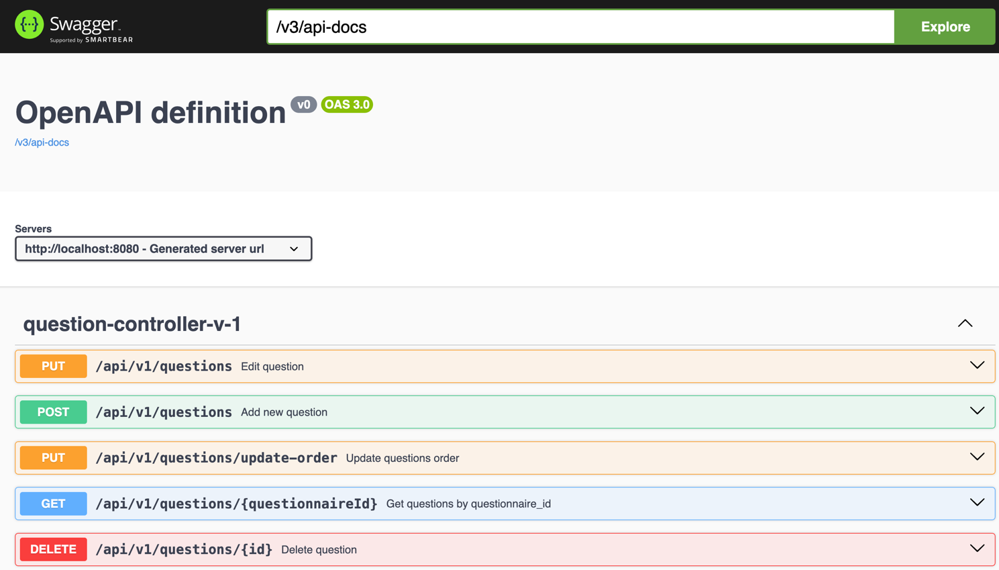

# API опросы пользователей

### Описание

Вопросы (Question) связаны с опросниками (Questionnaire) и имеют поле `orderNumber` для сохранения порядка вопросов.
Ответы (Answer) могут быть изменены только пока опрос не отправлен пользователем.
Отправка пользователем через эндпоинт `submitted-questionnaires`.

### Реализованные фичи и принятые решения

- Пользователь получает Активные опросы по дате начала, окончания и не отправленные пользователем
- Внедрение зависимостей через конструктор для простоты юнит-тестирования. С помощью Lombok `@RequiredArgsConstructor`
- Варианты ответов на вопросы хранятся в массиве Postgres
- Enum хранится как строка в БД с помощью Hibernate
- оптимистическая блокировка
- валидация входных данных и валидация сущностей, валидация endDate >= startDate
- OneToMany-ManyToOne cascade and orphan removal
- id generation type sequence
- предусмотрено версионирование API
- Dates as LocalDateTime
- records as DTO
- flyway миграции
- MockMVCTest - тестирование веб-слоя
- TestContainers для интеграционного тестирования
- Docker compose для локального развертывания (пока только бд)
- пагинация с помощью JPARepository
- авторизация через api-key, заголовок и ключ вынесены в application.yml
- порядок вопросов, уникальный констрейнт
- swagger UI с помощью springdoc OpenAPI 3.0
- @ControllerAdvice для обработки исключений

### Документация

http://localhost:8080/swagger-ui/index.html#/

